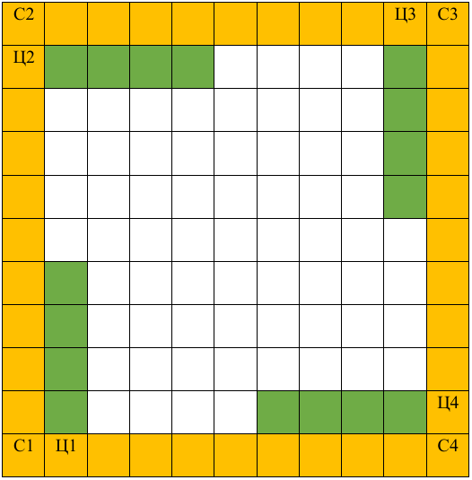

# Ne Ljuti Se Čoveče (Ludo) - Console Game

## Overview

"Ne ljuti se čoveče" is a classic board game implemented in C. The game involves four players moving their pieces across a board by rolling dice. The objective is to get all your pieces to the home area before your opponents. This console-based version allows you to initialize the board, roll dice, move pieces, and update the board after each turn.

## Features

- **Player Initialization**: Each player is initialized with a set of pieces, and the game begins with Player 1.
- **Dice Rolling**: A random number generator simulates dice rolls using a linear congruential generator (LCG).
- **Piece Movement**: Pieces are moved based on the dice roll, with special handling for starting positions and home areas.
- **Collision Detection**: Players can capture opponents' pieces if they land on the same tile.
- **Sparse Matrix Representation**: The game uses a compressed sparse column (CSC) format to store and update the board state efficiently.
- **Turn-based Gameplay**: The game handles player turns sequentially and offers options to either move existing pieces or add new ones to the board.

## How to Play

1. **Start the Game**: Run the program from the terminal. The game starts by prompting you to create a board and initialize players.
2. **Board Setup**: Define the dimensions of the board, which will be represented as a matrix.
3. **Player Moves**: Players take turns rolling the dice and moving their pieces. The game follows the standard rules of "Ne ljuti se čoveče."
4. **Winning Condition**: A player wins by moving all their pieces to the home area before anyone else.

Board example:



## File Descriptions

- **dz1.c**: The main C file containing the game logic, player initialization, dice rolling, and piece movement.
- **board.png**: An image of the starting board used as a visual reference for the game.

## Key Functions

- **`createHeader()`**: Initializes the player's list of pieces.
- **`addNodeToFront()` / `addNodeToBack()`**: Adds pieces to the player’s list, representing their position on the board.
- **`PopLastNode()`**: Removes a piece from the list when it reaches the home area or is captured.
- **`bacanjeKockice()`**: Simulates a dice roll using an LCG.
- **`kreirajTalon()` / `ispisiTalon()`**: Creates and prints the current board state.
- **`Potez()`**: Handles a player’s turn, offering the choice between moving a piece or adding a new one.
- **`pomeriFiguricu()`**: Moves a piece on the board based on the dice roll.
- **`Pojeden()`**: Handles capturing an opponent’s piece.

## Compilation and Execution

1. Compile the code using GCC:
   ```bash
   gcc dz1.c -o game
   ```
1. Run the game:
   ```bash
   ./game
   ```
